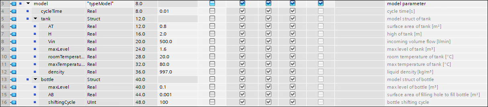
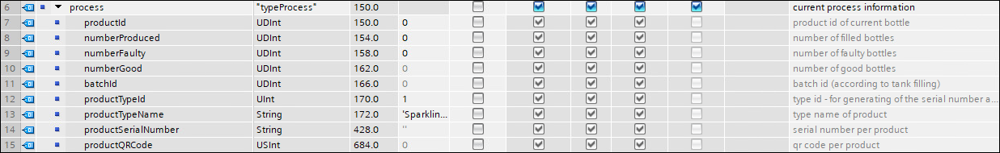
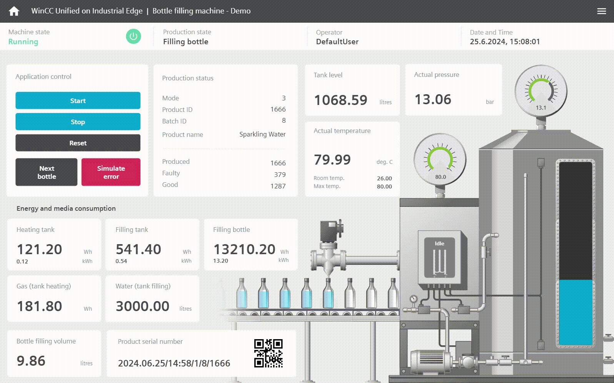
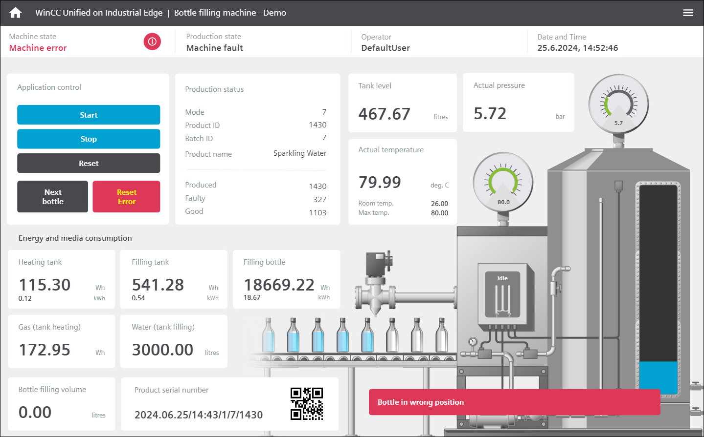
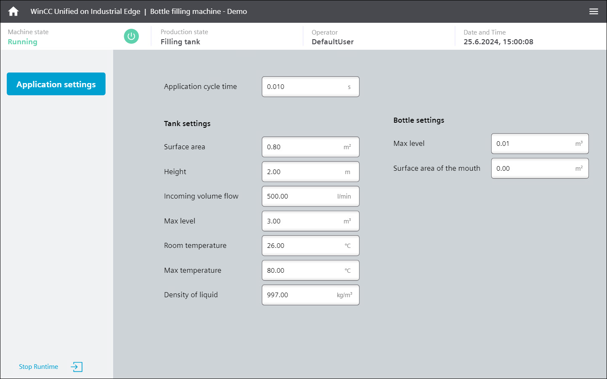
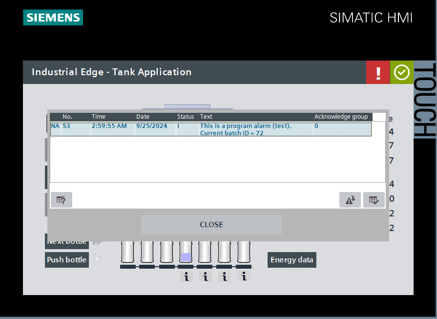
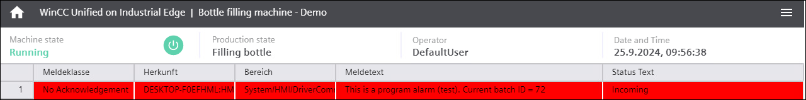
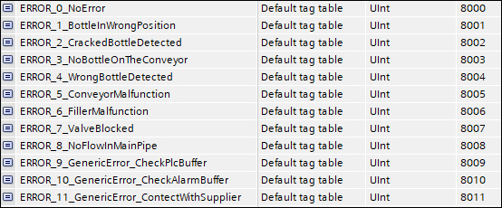
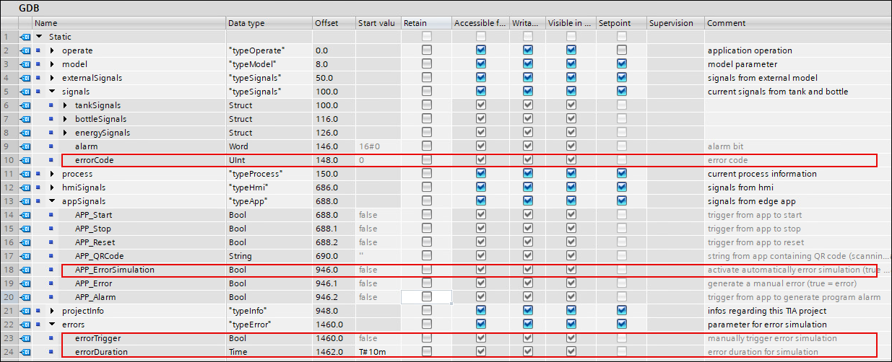

# Tank Application

This is the documentation for the TIA Portal project "tank application", which simulates a tank and filling process that is used as reference application for different How Tos within Industrial Edge.

- [Tank Application](#tank-application)
  - [Introduction](#introduction)
    - [Overview](#overview)
    - [Source files](#source-files)
    - [History](#history)
    - [Used components](#used-components)
  - [Engineering](#engineering)
    - [Mode of operation](#mode-of-operation)
    - [Interface DB](#interface-db)
  - [Operation of PLC](#operation-of-plc)
    - [Operation via HMI - TP900 Comfort](#operation-via-hmi---tp900-comfort)
    - [Operation via HMI - MTP1500 Unified Comfort](#operation-via-hmi---mtp1500-unified-comfort)
    - [Manual operation (intern)](#manual-operation-intern)
    - [Operation via Edge apps (extern)](#operation-via-edge-apps-extern)
    - [Program alarm](#program-alarm)
    - [Error simulation](#error-simulation)
  - [Edge use cases](#edge-use-cases)
    - [QR-Code scanner](#qr-code-scanner)
    - [Archiving and visualization](#archiving-and-visualization)
    - [Archiving and operation](#archiving-and-operation)
    - [IoT gateway](#iot-gateway)
    - [Data service - Getting started](#data-service---getting-started)
    - [Notifier - Getting started](#notifier---getting-started)
    - [Performance insight - Getting started](#performance-insight---getting-started)
    - [Performance insight - OEE Dashboard](#performance-insight---oee-dashboard)
    - [Energy manager - Getting started](#energy-manager---getting-started)
    - [Machine insight - Getting started](#machine-insight---getting-started)
    - [Profinet IO connector - Getting started](#profinet-io-connector---getting-started)
    - [Apache Kafka Connector](#apache-kafka-connector)
    - [Data concentrator with Data Service](#data-concentrator-with-data-service)
    - [Notifier API](#notifier-api)
  - [Contribution](#contribution)

## Introduction

### Overview

This application is used within various use cases to demonstrate the Industrial Edge functionality and apps. It is based on a TIA Portal project with corresponding HMI. The application simulates the filling process from a tank into bottles. The necessary simulation models for the tank and the bottles are embedded.

### Source files

The TIA Portal project can be found [here](tia-tank-application.zap19) as zap19 file (TIA compressed project) and can be opened directly in the TIA Portal V19 or higher.

### History

| Date        | Version | Note           |
| ------------| ------- | -------------- |
| 2021-05-20  |         | first version  |
| 2021-06-09  |         | changed parameter "process" (Int > DInt) |
| 2021-06-10  |         | new state 'Error' in parameter 'machineState', changed HMI |
| 2021-07-08  |         | changed parameter "process" (UDInt), added overflow handling, changed HMI docu: added options for operating the PLC, added use case |
| 2022-01-19  |         | changed PLC to CPU 1513-1, changed unity of energy data to Wh, changed TIA project from .zip to .zap16, added new use cases |
| 2022-11-24  |         | automatic start of filling process, automatic value generation for 'faulty bottles', embedded program alarm for testing |
| 2023-04-20  | [V1.0](https://github.com/industrial-edge/miscellaneous/tree/V1.0.0/tank%20application) | added new parameter for batchId, TIA projectInfo and gasConsumption |
| 2024-06-25 | V2.0 | migrated the TIA Portal project to V19, added a new Unified Comfort  Panel (MTP1500) in the TIA Portal project, new parameters: numberGood,  productTypeID, productTypeName, productSerialNumber, productQRCode |
| 2024-09-26  | V3.0 | added error simulation, adapted error codes, TP900: added visualization for water/gas consumption |

### Used components

This application example has been created with the following hardware and software components:

| Component | Version | Note |
| --------- | ------- | ---- |
| SIMATIC TIA Portal | V19 | simulation of HMI (TP900 Comfort) included |
| SIMATIC PLCSIM Advanced | V6.0 | can be used for simulation of PLC |
| SIMATIC Runtime Manager |  | can be used for simulation of the Unified Comfort panels or Unified PC Runtime |
| Industrial Edge Management | - | see specific How To |
| Industrial Edge Device | - | see specific How To |
| Industrial Edge Apps | - | see specific How To |

## Engineering

The TIA Portal project consists of a CPU 1513-1, a T900 Comfort panel and a MTP1500 Unified Comfort panel.

The CPU contains the engineering program for the whole tank application. It also runs on every other S7-1500 PLC. Alternatively the PLC can be simulated via PlcSim Advanced.

### Mode of operation

The application works as following:

Once the application is started, it runs through the different operating states and delivers important process values that can be used for further processing within Industrial Edge. As soon as the tank is empty, the tank filling process starts again (also represent by the paramter *GDB.process.batchId*) to ensure an endless sequence. When the maximum value of the parameter *GDB.process.numberProduced* is reached, the application goes into stop, then reset and starts again from the beginning to avoid an overflow.

"Next bottle" is shifting the current bottle to simulate a not completely filled bottle. In this case the parameter *GDB.process.numberFaulty* is increased.

"Stop" pauses the whole filling process. It can be continued with the "Start" action.

"Reset" resets all process values. This is only possible, when the application is stopped.

### Interface DB

The data exchange between the TIA Portal project and the Industrial Edge apps is done via the global DB “GDB”. This DB is set to ‘not optimized’, to be able to work with the offsets.

Parameter "operate"

Parameter "model"

Parameter "externalSignals"

Parameter "signals"

Parameter "process"

Parameter "hmiSignals"

Parameter "appSignals"

Parameter "projectInfo"

Parameter "errors"

## Operation of PLC

The tank application can be controlled as following:

- via the included HMIs: TP900 Comfort and MTP1500 Unified Comfort
- manually in the global DB “GDB” (from intern)
- via Edge apps (from extern)

### Operation via HMI

The included TP900 Comfort can be simulated within the TIA Portal. Here the filling process can be started, stopped, and reset in an user-friendly way. It also visualizes the whole filling process. The HMI can be connected to a real PLC or to PlcSim Advanced, to get the process data.

> **NOTE:**  Please make sure your PG/PC interfaces settings are configured properly.

To simulate some faulty products, the process can be interrupted by clicking on the button “Next bottle” during filling of a bottle. In this case the "Bottles faulty" number increases.

By clicking the button "Push bottle", an error is simulated and the process stops. In this case the parameter *GDB.operate.machineState* is set to *STATE_ERROR* (7). The process can be started again, once the error was resolved. This can be done by clicking the button "Place bottle".

When clicking on the button "Energy data", some energy relevant values are displayed.

### Operation via HMI - MTP1500 Unified Comfort

The included MTP1500 Unified Comfort can be simulated on any web browser with the help of the SIMATIC Runtime Manager. Here the filling process can be started, stopped, and reset in an user-friendly way. It also visualizes the whole filling process. The HMI can be connected to a real PLC or to PLCSim Advanced, to get the process data.

> **NOTE:**  Please make sure your PG/PC interfaces settings are configured properly. Also make sure that you went trough the WinCC Unified Configuration wizard for getting valid certificates.

To simulate some faulty products, the process can be interrupted by clicking on the button “Next bottle” during filling of a bottle. In this case the "Bottles faulty" number increases.

By clicking the button "Simulate error", an error is simulated and the process stops. In this case the parameter *GDB.operate.machineState* is set to *STATE_ERROR* (7). The process can be started again, once the error was resolved. This can be done by clicking the button "Reset error".

On this HMI, all energy data are displayed directly on the main application screen.

When clicking on the menu sign  and then on "Settings", the following screen is displayed:

Here you can see some additional parameters and set it differently, as well as stop the runtime if needed.

### Manual operation (intern)

The tank application can be controlled manually in the global DB “GDB". Therefore the following parameter must be set to TRUE (right after these parameter are reset automatically to FALSE):

- *GDB.hmiSignals.HMI_Start*
- *GDB.hmiSignals.HMI_Stop*
- *GDB.hmiSignals.HMI_Reset* (only possible, when the application is stopped)

To simulate some faulty products and increase the number of "bottles faulty", the process can be interrupted by setting this parameter to TRUE during filling of a bottle (right after the parameter is reset automatically to FALSE):

- *GDB.hmiSignals.HMI_NextBottle*

It is also possible to simulate an error, which stops the whole filling process. In this case the parameter *GDB.operate.machineState* is set to *STATE_ERROR* (7). Therefore this parameter must be set to TRUE. The process can be started again, once the paramter was reset to FALSE:

- *GDB.hmiSignals.HMI_Error*

### Operation via Edge Apps (extern)

The tank application can be controlled via self developed Edge apps. Therefore the following parameters must be triggered (see dedicated explanations):

- *GDB.appSignals.APP_Start* (chapter [Manual operation](#manual-operation-intern)))
- *GDB.appSignals.APP_Stop* (chapter [Manual operation](#manual-operation-intern)))
- *GDB.appSignals.APP_Reset* (chapter [Manual operation](#manual-operation-intern))
- *GDB.appSignals.APP_QRCode* (chapter [Manual operation](#qr-code-scanner))
- *GDB.appSignals.APP_ErrorSimulation* (chapter [Error simulation](#error-simulation))
- *GDB.appSignals.APP_Error* (chapter [Error simulation](#error-simulation))
- *GDB.appSignals.APP_Alarm* (chapter [Program alarm](#program-alarm))

TIA Portal code, where the operating commands are handled:

### Program alarm

The tank application offers the possibility to simulate a program alarm for testing purposes. Therefore the parameter *GDB.appSignals.APP_Alarm* acts as trigger. As long as this parameter is set to TRUE, the program alarm is active and shows the text "This is a program alarm (test). Current batch ID = \<batchID>" (with variable content for \<batchID>). The alarm status is written in the parameter *GDB.signals.alarm*. This active alarm is also visualised in the HMI, where the alarm table can be opened.

TP900:

MTP1500:

### Error simulation

1\) It is possible to **manually simulate an error**, which stops the whole filling process. In this case the parameter *GDB.operate.machineState* is set to *STATE_ERROR* (7). To trigger the error this parameter must be set to TRUE:

- *GDB.appSignals.APP_Error*

The error is available as long as this parameter is set to TRUE. You need to manually reset the error paramter by setting it to FALSE. After each error occurance the machine state goes automatically into STATE_STOP (5).The process can be continued, once you trigger the parameter *GDB.appSignals.APP_Start*.

2\) The tank application offers the possibility to **automatically simulate predefined production errors** (unplanned downtimes). The simulation is deactivated by default. To activate the error simulation, this parameter must be set to TRUE:

 - *GDB.appSignals.APP_ErrorSimulation*

The program randomly simulates an error whith a predefined duration of 10 minutes (adaptable via parameter GDB.errors.errorDuration). In this case the parameter GDB.operate.machineState is set to STATE_ERROR (7). The program also generates an error code and assigns it to the parameter GDB.errors.errorCode (UInt). Possible error codes are:

The dedicated parameters can be found under *GDB.errors*:

- *GDB.errors.errorTrigger* can be used to manually trigger an one-time error occurance when setting it to TRUE (therefore *GDB.appSignals.APP_ErrorSimulation* must be activated). In this case the parameter GDB.operate.machineState is set to STATE_ERROR (7).

- *GDB.errors.errorDuration* defines the error duration of the simulated errors. The default setting is 10 minutes. This can be changed as needed.

After each error occurance the machine state goes automatically into STATE_STOP (5).The process can be continued, once you trigger the parameter *GDB.appSignals.APP_Start*.

## Edge use cases

### QR-Code scanner

The related How To can be found [here](https://github.com/industrial-edge/qr-code-scanner).

The application reads the QR Code provided by the scanner and publishes it on the IE Databus to the topic corresponding to the S7 Connector, which sends the data to the PLC (parameter *APP_QRCode*). If the PLC receives a new QR Code String, the information is displayed in the HMI Panel.

Interface parameter:

- *GDB.appSignals.APP_QRCode*

Example of scanned QR code in HMI:

### Archiving and visualization

The related How To can be found [here](https://github.com/industrial-edge/archiving-and-visualization).

The Industrial Edge Application "Archiving & Visualization” collects data values, stores them in an Influxdb database and visualize them with a Grafana dashboard.

Interface parameter:

- *GDB.signals.tankSignals.actLevel*
- *GDB.signals.tankSignals.actTemperature*
- *GDB.process.numberProduced*
- *GDB.process.numberFaulty*
- *GDB.hmiSignals.HMI_NextBottle*

### Archiving and operation

The related How To can be found [here](https://github.com/industrial-edge/archiving-and-operation).

The Industrial Edge Application "Archiving & Operation" provides a web UI for operating the tank application with push buttons to start, stop and reset the filling process. By pushing the buttons, a http request is sended to the MQTT client of the app and forwarded to the IE Databus. The S7 Connector receives the message and writes the control command to the PLC, that is controlling the tank application.

Interface parameter:

- *GDB.appSignals.APP_Start*
- *GDB.appSignals.APP_Stop*
- *GDB.appSignals.APP_Reset*

### IoT gateway

The related How To can be found [here](https://github.com/industrial-edge/iot-gateway).

Using the IE system apps to preprocess PLC data and push it to the cloud.

Interface parameter:

- *GDB.signals.tankSignals.actLevel*

### Data service - Getting started

The related How To can be found [here](https://github.com/industrial-edge/data-service-getting-started).

This example shows how to use the Industrial Edge App "Data Service" to model data structure and store data.

Interface parameter:

- *GDB.process.numberProduced*
- *GDB.process.numberFaulty*
- *GDB.signals.tankSignals.actLevel*
- *GDB.signals.tankSignals.actTemperature*

### Notifier - Getting started

The related How To can be found [here](https://github.com/industrial-edge/notifier-getting-started).

Example showing how to use the Industrial Edge App "Notifier" to create notifications in case of an event.

Interface parameter:

- *GDB.process.numberProduced*
- *GDB.process.numberFaulty*
- *GDB.signals.tankSignals.actLevel*
- *GDB.signals.tankSignals.actTemperature*

### Performance insight - Getting started

The related How To can be found [here](https://github.com/industrial-edge/performance-insight-getting-started).

This document describes how to get the data from a PLC into the Performance Insight app to visualize modeled data.

Interface parameter:

- *GDB.signals.tankSignals.actLevel*
- *GDB.signals.tankSignals.actTemperature*
- *GDB.process.numberProduced*
- *GDB.process.numberFaulty*
- *GDB.operate.machineState*

The parameter *GDB.operate.machineState* can have the following states:

### Performance insight - OEE Dashboard

The related How To can be found [here](https://github.com/industrial-edge/Performance-Insight-OEE-Dashboard).

This example shows how to generate an OEE (Overall Equipment Effectiveness) Dashboard within the Performance Insight app. By defining key performance indicators, the productivity of a plant can be calculated and transparently displayed.

Interface parameter:

- *GDB.operate.machineState*

### Energy manager - Getting started

The related How To can be found [here](https://github.com/industrial-edge/energy-manager-getting-started).

This example shows how to use the Industrial Edge App “Energy Manager”. The Energy Manager will help you make the transition from energy transparency to energy efficiency.

Interface parameter:

- *GDB.signals.energySignals.energyConsumptionFillingTank*
- *GDB.signals.energySignals.waterConsumptionFillingTank*
- *GDB.signals.energySignals.energyConsumptionHeatingTank*
- *GDB.signals.energySignals.energyConsumptionFillingBottle*

### Machine insight - Getting started

The related How To can be found [here](https://github.com/industrial-edge/machine-insight-getting-started).

This example shows how to use the Industrial Edge App “Machine Insight”. Machine Insight enables the collection of data from different sources. The data can be of different types: Device and machine status data, messages, diagnostic buffer data and program changes or firmware updates in the PLC.

### Profinet IO connector - Getting started

The related How To can be found [here](https://github.com/industrial-edge/profinet-io-connector-getting-started).

This example shows how to use the Industrial Edge App “PROFINET IO Connector”. This app implements a PROFINET Controller which cyclically reads the PN IO data of the configured PROFINET network.

### Apache Kafka Connector

The related How To can be found [here](https://github.com/industrial-edge/Apache-Kafka-Connector).

This example shows how to connect an Industrial Edge Device to Apache Kafka using the self developed app "Apache Kafka Connector". It can subscribe to MQTT topics on the IE Databus and produce messages on a Kafka topic. It can also consume messages from a Kafka topic and publish these to MQTT topics an the IE Databus.

### Data concentrator with Data Service

The related How To can be found [here](https://github.com/industrial-edge/data-concentrator-data-service).

This example shows how to centrally send data from the field level (several edge devices) to a higher-level edge device. Therefore two edge devices forward their data via the Cloud Connector (local lake) to a higher-level edge decice. This central edge device uses the Data Service custom adapters to collect the data from the field level and analyze it via Performance Insight.

### Notifier API

The related How To can be found [here](https://github.com/industrial-edge/notifier-api).

This guide shows how to use the Notifier OpenAPI in different ways. The API is implemented within an user-developed app to send notifications to the Notifier.

## Contribution

Thanks for your interest in contributing. Anybody is free to report bugs, unclear documentation, and other problems regarding this repository in the Issues section or, even better, is free to propose any changes to this repository using Merge Requests.
