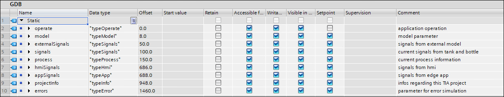
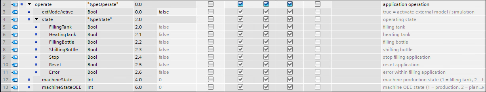

# Tank Application

This is the documentation for the TIA Portal project [tia-tank-application.7z](https://github.com/industrial-edge/miscellaneous/blob/main/tank%20application/tia-tank-application.7z). The project simulates a tank and filling process that is used as reference application for different How Tos within industrial edge.

- [Tank Application](#tank-application)
  - [Introduction](#introduction)
    - [Overview](#overview)
    - [Source files](#source-files)
    - [History](#history)
    - [Used components](#used-components)
  - [Mode of operation](#mode-of-operation)
  - [Engineering](#engineering)
    - [Interface DB](#interface-db)
  - [Edge use cases](#edge-use-cases)
    - [QR-Code scanner](#qr-code-scanner)
    - [Archiving and visualization](#archiving-and-visualization)
    - [Archiving and operation](#archiving-and-operation)
    - [IoT gateway](#iot-gateway)
    - [Data service - Getting started](#data-service---getting-started)
    - [Notifier - Getting started](#notifier---getting-started)
    - [Performance insight - Getting started](#performance-insight---getting-started)
    - [Energy manager - Getting started](#energy-manager---getting-started)
    - [Machine insight - Getting started](#machine-insight---getting-started)
    - [Profinet IO connector - Getting started](#profinet-io-connector---getting-started)
  - [Contribution](#contribution)

## Introduction

### Overview

This application is used within various use cases to demonstrate the industrial edge functionality and apps. It is based on a STEP 7 TIA project with corresponding HMI. The application simulates the filling process from a tank into bottles. The necessary simulation models for the tank and the bottles are embedded.

### Source files

The source files for the TIA project containing this tank application can be found [here](https://github.com/industrial-edge/miscellaneous/blob/main/tank%20application/tia-tank-application.7z)

### History

| Date | Note |
| ----------- | -------------- |
| May 20, 2021 | first version |

### Used components

This application example has been created with the following hardware and software components:

| Component | Version | Note |
| ----------- | ----------- | -------------- |
| SIMATIC TIA Portal | V16 | Simulation of HMI included |
| SIMATIC PLCSIM Advanced | V3.0 | Can be used for simulation of PLC |
| Industrial Edge Management | - | See How To for used version |
| Industrial Edge Device | - | See How To for used version |
| Industrial Edge Apps | - | See How To for used versions |

## Mode of operation

The application works as following:

The tank application can be controlled via the embedded HMI. Here the process can be started, stopped, and reset.
The application runs through the different operating states and delivers important process values that can be used for further processing within industrial edge.
As soon as the tank is empty, the tank filling process starts again to ensure an endless sequence.
Reset is only possible, when the application is stopped (Button "Stop"). In this case all process values are reset.

To simulate some faulty products, the process can be interrupted by clicking on the button “next bottle” during filling of a bottle. In this case the "Bottles faulty" number increases.

When clicking on the button "Energy data", some energy relevant values are displayed.

## Engineering

The TIA portal project consists of a CPU 1518 ODK and a corresponding HMI. The application also runs on every other PLC, e.g. CPU 1511.

The CPU contains the engineering program for the whole tank application, that can be controlled via the HMI. Alternatively, the tank application can be controlled via the Industrial Edge apps by triggering the corresponding parameters.

### Interface DB

The data exchange between the TIA portal project and the Industrial Edge apps is done via the global DB “GDB”. This DB is set to ‘not optimized’, to be able to work with the offsets.

Overview of DB:

Parameter "operate"

Parameter "model"

Parameter "externalSignals"

Parameter "signals"

Parameter "process"

Parameter "hmiSignals"

Parameter "appSignals"

## Edge use cases

### QR-Code scanner

### Archiving and visualization

### Archiving and operation

### IoT gateway

### Data service - Getting started

### Notifier - Getting started

### Performance insight - Getting started

### Energy manager - Getting started

### Machine insight - Getting started

### Profinet IO connector - Getting started

## Contribution

Thanks for your interest in contributing. Anybody is free to report bugs, unclear documentation, and other problems regarding this repository in the Issues section or, even better, is free to propose any changes to this repository using Merge Requests.
