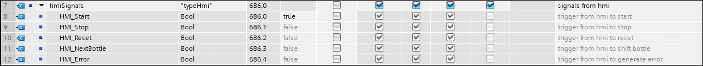
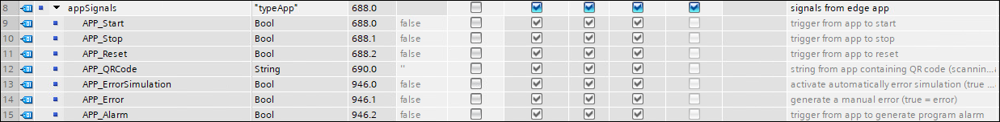
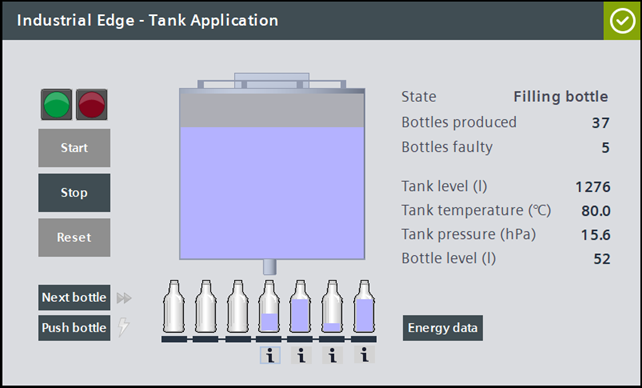
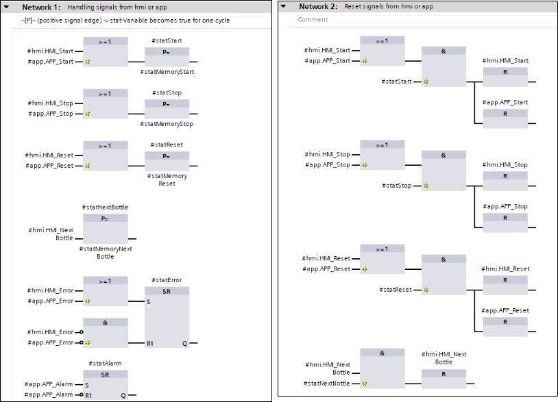

# Tank Application

This is the documentation for the TIA Portal project [tia-tank-application.7z](https://github.com/industrial-edge/miscellaneous/blob/main/tank%20application/tia-tank-application.7z). The project simulates a tank and filling process that is used as reference application for different How Tos within Industrial Edge.

- [Tank Application](#tank-application)
  - [Introduction](#introduction)
    - [Overview](#overview)
    - [Source files](#source-files)
    - [History](#history)
    - [Used components](#used-components)
  - [Engineering](#engineering)
    - [Mode of operation](#mode-of-operation)
    - [Interface DB](#interface-db)
  - [Operation of PLC](#operation-of-plc)
    - [Operation via HMI](#operation-via-hmi)
    - [Manual operation (intern)](#manual-operation-intern)
    - [Operation via Edge apps (extern)](#operation-via-edge-apps-extern)
  - [Edge use cases](#edge-use-cases)
    - [QR-Code scanner](#qr-code-scanner)
    - [Archiving and visualization](#archiving-and-visualization)
    - [Archiving and operation](#archiving-and-operation)
    - [IoT gateway](#iot-gateway)
    - [Data service - Getting started](#data-service---getting-started)
    - [Notifier - Getting started](#notifier---getting-started)
    - [Performance insight - Getting started](#performance-insight---getting-started)
    - [Performance insight - OEE Dashboard](#performance-insight---oee-dashboard)
    - [Energy manager - Getting started](#energy-manager---getting-started)
    - [Machine insight - Getting started](#machine-insight---getting-started)
    - [Profinet IO connector - Getting started](#profinet-io-connector---getting-started)
  - [Contribution](#contribution)

## Introduction

### Overview

This application is used within various use cases to demonstrate the industrial edge functionality and apps. It is based on a STEP 7 TIA project with corresponding HMI. The application simulates the filling process from a tank into bottles. The necessary simulation models for the tank and the bottles are embedded.

### Source files

The source files for the TIA project containing this tank application can be found [here](https://github.com/industrial-edge/miscellaneous/blob/main/tank%20application/tia-tank-application.7z)

### History

| Date | Note |
| ----------- | -------------- |
| May 20, 2021 | first version |
| June 9, 2021 | changed parameter "process" (Int > DInt) |
| June 10, 2021 | new state 'Error' in parameter 'machineState', changed UI |
| July 1, 2021 | added options for operating the PLC |

### Used components

This application example has been created with the following hardware and software components:

| Component | Version | Note |
| ----------- | ----------- | -------------- |
| SIMATIC TIA Portal | V16 | simulation of HMI included |
| SIMATIC PLCSIM Advanced | V3.0 | can be used for simulation of PLC |
| Industrial Edge Management | - | see specific How To |
| Industrial Edge Device | - | see specific How To |
| Industrial Edge Apps | - | see specific How To |

## Engineering

The TIA portal project consists of a CPU 1518 ODK and a corresponding HMI.

The CPU contains the engineering program for the whole tank application. It also runs on every other S7-1500 PLC, e.g. CPU 1511. Alternatively the PLC can be simulated via PlcSim Advanced.

### Mode of operation

The application works as following:

Once the application is started, it runs through the different operating states and delivers important process values that can be used for further processing within industrial edge.
As soon as the tank is empty, the tank filling process starts again to ensure an endless sequence.

"Next bottle" is shifting the current bottle to simulate a not completely filled bottle. In this case the parameter *GDB.process.numberFaulty* is increased.

"Stop" pauses the whole filling process. It can be continued with the "Start" action.

"Reset" resets all process values. This is only possible, when the application is stopped.

### Interface DB

The data exchange between the TIA portal project and the Industrial Edge apps is done via the global DB “GDB”. This DB is set to ‘not optimized’, to be able to work with the offsets.

Parameter "operate"

Parameter "model"

Parameter "externalSignals"

Parameter "signals"

Parameter "process"

Parameter "hmiSignals"

Parameter "appSignals"

## Operation of PLC

The tank application can be controlled as following:

- via the included HMI
- manually in the global DB “GDB” (from intern)
- via Edge apps (from extern)

### Operation via HMI

The included HMI can be simulated within the TIA Portal. Here the filling process can be started, stopped, and reset in an user-friendly way. It also visualizes the whole filling process. The HMI can be connected to a real PLC or to PlcSim Advanced, to get the process data.

> **NOTE:**  Please make sure your PG/PC interfaces settings are configured properly.

To simulate some faulty products, the process can be interrupted by clicking on the button “Next bottle” during filling of a bottle. In this case the "Bottles faulty" number increases.

By clicking the button "Push bottle", an error is simulated and the process stops. In this case the parameter *GDB.operate.machineState* is set to *STATE_ERROR* (7). The process can be started again, once the error was resolved. This can be done by clicking the button "Place bottle".

When clicking on the button "Energy data", some energy relevant values are displayed.

### Manual operation (intern)

The tank application can be controlled manually in the global DB “GDB". Therefore the following parameters must be triggered (set to true, set to false):

- *GDB.hmiSignals.HMI_Start*
- *GDB.hmiSignals.HMI_Stop*
- *GDB.hmiSignals.HMI_Reset* (only possible, when the application is stopped)

### Operation via Edge Apps (extern)

The tank application can be controlled via self developed Edge apps. Therefore the following parameters must be triggered:

- *GDB.appSignals.APP_Start*
- *GDB.appSignals.APP_Stop*
- *GDB.appSignals.APP_Reset* (only possible, when the application is stopped)

## Edge use cases

### QR-Code scanner

The related How To can be found [here](https://github.com/industrial-edge/qr-code-scanner).

The application reads the QR Code provided by the scanner and publishes it on the IE Databus to the topic corresponding to the S7 Connector, which sends the data to the PLC (parameter *APP_QRCode*). If the PLC receives a new QR Code String, the information is displayed in the HMI Panel.

Interface parameter:

- *GDB.appSignals.APP_QRCode*

Example of scanned QR code in HMI:

### Archiving and visualization

The related How To can be found [here](https://github.com/industrial-edge/archiving-and-visualization).

The Industrial Edge Application "Archiving & Visualization” collects data values, stores them in an Influxdb database and visualize them with a Grafana dashboard.

Interface parameter:

- *GDB.signals.tankSignals.actLevel*
- *GDB.signals.tankSignals.actTemperature*
- *GDB.process.numberProduced*
- *GDB.process.numberFaulty*
- *GDB.hmiSignals.HMI_NextBottle*

### Archiving and operation

The related How To can be found [here](https://github.com/industrial-edge/archiving-and-operation).

The Industrial Edge Application "Archiving & Operation" provides a web UI for operating the tank application with push buttons to start, stop and reset the filling process. By pushing the buttons, a http request is sended to the MQTT client of the app and forwarded to the IE Databus. The S7 Connector receives the message and writes the control command to the PLC, that is controlling the tank application.

Interface parameter:

- *GDB.appSignals.APP_Start*
- *GDB.appSignals.APP_Stop*
- *GDB.appSignals.APP_Reset*

TIA project code, where the operating commands are handled:

### IoT gateway

The related How To can be found [here](https://github.com/industrial-edge/iot-gateway).

Using the IE system apps to preprocess PLC data and push it to the cloud.

Interface parameter:

- *GDB.signals.tankSignals.actLevel*

### Data service - Getting started

The related How To can be found [here](https://github.com/industrial-edge/data-service-getting-started).

This example shows how to use the Industrial Edge App "Data Service" to model data structure and store data.

Interface parameter:

- *GDB.process.numberProduced*
- *GDB.process.numberFaulty*
- *GDB.signals.tankSignals.actLevel*
- *GDB.signals.tankSignals.actTemperature*

### Notifier - Getting started

The related How To can be found [here](https://github.com/industrial-edge/notifier-getting-started).

Example showing how to use the Industrial Edge App "Notifier" to create notifications in case of an event.

Interface parameter:

- *GDB.process.numberProduced*
- *GDB.process.numberFaulty*
- *GDB.signals.tankSignals.actLevel*
- *GDB.signals.tankSignals.actTemperature*

### Performance insight - Getting started

The related How To can be found [here](https://github.com/industrial-edge/performance-insight-getting-started).

This document describes how to get the data from a PLC into the Performance Insight app to visualize modeled data.

Interface parameter:

- *GDB.signals.tankSignals.actLevel*
- *GDB.signals.tankSignals.actTemperature*
- *GDB.process.numberProduced*
- *GDB.process.numberFaulty*
- *GDB.operate.machineState*

The parameter *GDB.operate.machineState* can have the following states:

### Performance insight - OEE Dashboard

The related How To can be found [here](https://github.com/industrial-edge/Performance-Insight-OEE-Dashboard).

This example shows how to generate an OEE (Overall Equipment Effectiveness) Dashboard within the Performance Insight app. By defining key performance indicators, the productivity of a plant can be calculated and transparently displayed.

Interface parameter:

- *GDB.operate.machineState*

### Energy manager - Getting started

The related How To can be found [here](https://github.com/industrial-edge/energy-manager-getting-started).

This example shows how to use the Industrial Edge App “Energy Manager”. The Energy Manager will help you make the transition from energy transparency to energy efficiency.

Interface parameter:

- *GDB.signals.energySignals.energyConsumptionFillingTank*
- *GDB.signals.energySignals.waterConsumptionFillingTank*
- *GDB.signals.energySignals.energyConsumptionHeatingTank*
- *GDB.signals.energySignals.energyConsumptionFillingBottle*

### Machine insight - Getting started

The related How To can be found [here](https://github.com/industrial-edge/machine-insight-getting-started).

This example shows how to use the Industrial Edge App “Machine Insight”. Machine Insight enables the collection of data from different sources. The data can be of different types: Device and machine status data, messages, diagnostic buffer data and program changes or firmware updates in the PLC.

### Profinet IO connector - Getting started

The related How To can be found [here](https://github.com/industrial-edge/profinet-io-connector-getting-started).

This example shows how to use the Industrial Edge App “PROFINET IO Connector”. This app implements a PROFINET Controller which cyclically reads the PN IO data of the configured PROFINET network.

## Contribution

Thanks for your interest in contributing. Anybody is free to report bugs, unclear documentation, and other problems regarding this repository in the Issues section or, even better, is free to propose any changes to this repository using Merge Requests.
